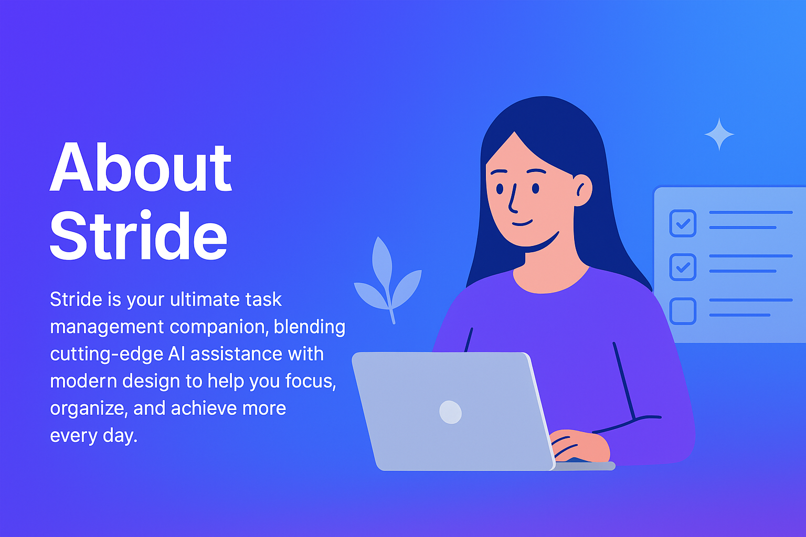

Perfect — let’s craft a **detailed and beautiful README** for your project.
I’ll give you a markdown version that looks professional, highlights features, usage, and design philosophy, and matches the **Stride** branding you used.

Here’s the full `README.md`:

````markdown
# 🚀 Stride – AI-powered Task Management

Simplify productivity with **Stride**, an AI-powered task management platform that helps you stay focused, organized, and efficient.  
Built with **Next.js 14**, **Tailwind CSS**, and best practices for modern web apps.

---

## ✨ Features

- ⚡ **Next.js 14 (App Router)** – blazing-fast, SEO-friendly, modern React architecture.
- 🎨 **Responsive UI** – optimized for mobile, tablet, and desktop using Tailwind CSS.
- 🤖 **AI-powered productivity** – intelligent task suggestions and workflow automation.
- 🔗 **Reusable Components** – modular structure for scalability and maintainability.
- 🌍 **Accessible & Inclusive** – semantic HTML, ARIA labels, and keyboard navigation.
- 📚 **Developer Friendly** – clean code, easy to extend, and open for contribution.

---

## 📂 Project Structure

```bash
stride/
├── app/                 # Next.js App Router pages
├── components/          # Reusable React components (Hero, Footer, Navbar, etc.)
├── public/              # Static assets (icons, images, favicon)
├── styles/              # Global styles (Tailwind setup)
├── README.md            # You are here 🚀
└── package.json         # Dependencies and scripts
````

---

## 🖼️ UI Previews

### Hero Section



### Footer

The footer is fully responsive and contains:

* **Brand Info** (Stride + tagline)
* **Navigation Links** (Features, About, Docs, Contact)
* **Social Links** (GitHub, LinkedIn, Twitter) with inline SVG icons
* **Copyright Bar**

---

## 🛠️ Tech Stack

* **Framework**: [Next.js 14](https://nextjs.org/)
* **Styling**: [Tailwind CSS](https://tailwindcss.com/)
* **Icons**: Inline SVGs (optimized, no external dependencies)
* **Deployment**: [Vercel](https://vercel.com/) (recommended)

---

## ⚙️ Installation & Setup

Clone the repo:

```bash
git clone https://github.com/theDevSoham/stride.git
cd stride
```

Install dependencies:

```bash
npm install
# or
yarn install
```

Run the development server:

```bash
npm run dev
# or
yarn dev
```

Visit the app at: [http://localhost:3000](http://localhost:3000)

---

## 🚀 Deployment

Deploy directly to [Vercel](https://vercel.com/) for the best Next.js experience:

```bash
vercel
```

Or build manually:

```bash
npm run build
npm run start
```

---

## 📐 Design Philosophy

* **Minimal & Clean** – focus on readability and UX.
* **Scalable** – modular components for future growth.
* **Accessible** – designed with WCAG standards in mind.
* **Performance-First** – optimized bundle size, lazy loading where possible.

---

## 🤝 Contributing

Contributions are welcome!
Please fork the repository and submit a pull request.

1. Fork the repo
2. Create a feature branch (`git checkout -b feature/amazing-feature`)
3. Commit changes (`git commit -m "Add amazing feature"`)
4. Push to branch (`git push origin feature/amazing-feature`)
5. Open a PR 🚀

---

## 🌟 Acknowledgements

* [Next.js](https://nextjs.org/) for the foundation
* [Tailwind CSS](https://tailwindcss.com/) for styling
* [Vercel](https://vercel.com/) for seamless deployment

---

## 📜 License

This project is licensed under the **MIT License**.
You are free to use, modify, and distribute this software.

---

## 💡 About

**Stride** was created with the mission to **simplify productivity** using AI-powered task management.
Crafted with ❤️ by [Soham Das](https://linkedin.com/in/thedevsoham).

```

---

This will render beautifully on GitHub with emojis, sections, and screenshots (`about-hero.png` already fits).  

👉 Do you also want me to add **badges** (like GitHub stars, forks, Next.js, Tailwind, Vercel) at the top for extra polish?
```
